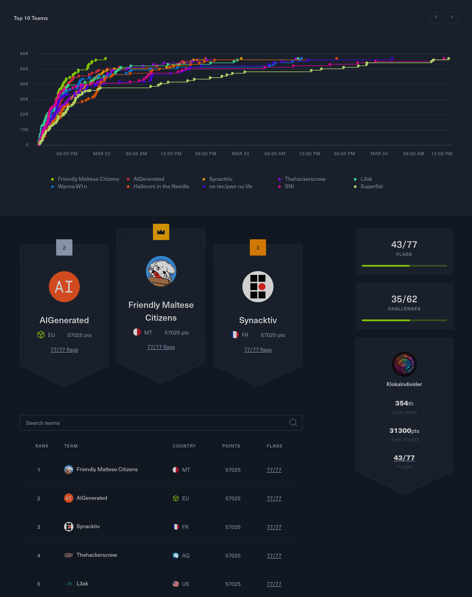

# Cyber Apocalypse CTF 2025: Tales from Eldoria
- https://ctf.hackthebox.com/event/details/cyber-apocalypse-ctf-2025-tales-from-eldoria-2107

## Description

**Start Date**: `21 Mar 2025, 13:00`

**End Date**: `26 Mar, 13:00`

### Lore
*In the ancient realm of Eldoria, a land rich with magic and steeped in legend, peace has reigned for centuries under the guidance of wise rulers and the protection of mystical creatures. Central to this harmony is the Dragon's Heart, a legendary artifact forged in the dawn of time by the dragon elders. The artifact maintains the balance between the mortal world and the realm of dragons, ensuring mutual respect and coexistence.*

*However, whispers of discontent echo through the mountains and forests. Lord Malakar, a once-honorable knight turned warlord, becomes obsessed with the legends of old, seeking power beyond mortal means. Consumed by ambition and driven by a prophecy foretelling a new world order under his rule, Malakar betrays his oaths and steals the Dragon's Heart from its sacred sanctuary.*

*With the artifact in his grasp, Malakar gains the ability to control dragons, creatures of immense power. He begins a campaign of conquest, using fear and force to bend kingdoms to his will. The skies darken with dragon wings, and flames consume villages as resistance crumbles.*

*Amidst the chaos, fate weaves together a diverse group of adventurers, each affected by Malakar's tyranny in personal ways. They form a fellowship bound by a common goal: to reclaim the Dragon's Heart and restore peace to Eldoria.*

# Results
**Username:** arch-err

**Team:** KlokaIndivider

**Flags:** (3/62)

# Challenges

## Blockchain
- [ ] [Eldorion](challenges/Eldorion)
- [ ] [HeliosDEX](challenges/HeliosDEX)
- [ ] [EldoriaGate](challenges/EldoriaGate)

## Web
- [ ] [Trial_by_Fire](challenges/Trial_by_Fire)
- [x] [Whispers_of_the_Moonbeam](challenges/Whispers_of_the_Moonbeam)
- [ ] [Cyber_Attack](challenges/Cyber_Attack)
- [ ] [Eldoria_Panel](challenges/Eldoria_Panel)
- [ ] [Eldoria_Realms](challenges/Eldoria_Realms)
- [ ] [Aurors_Archive](challenges/Aurors_Archive)

## OSINT
- [ ] [Echoes_in_Stone](challenges/Echoes_in_Stone)
- [ ] [The_Stone_That_Whispers](challenges/The_Stone_That_Whispers)
- [ ] [The_Hillside_Haven](challenges/The_Hillside_Haven)
- [ ] [The_Mechanical_Birds_Nest](challenges/The_Mechanical_Birds_Nest)
- [ ] [The_Poisoned_Scroll](challenges/The_Poisoned_Scroll)
- [ ] [The_Shadowed_Sigil](challenges/The_Shadowed_Sigil)
- [ ] [The_Ancient_Citadel](challenges/The_Ancient_Citadel)

## Coding
- [x] [Summoners_Incantation](challenges/Summoners_Incantation)
- [ ] [Enchanted_Cipher](challenges/Enchanted_Cipher)
- [ ] [Dragon_Fury](challenges/Dragon_Fury)
- [ ] [Dragon_Flight](challenges/Dragon_Flight)
- [ ] [ClockWork_Gurdian](challenges/ClockWork_Gurdian)

## Forensics
- [x] [Thorins_Amulet](challenges/Thorins_Amulet)
- [ ] [A_new_Hire](challenges/A_new_Hire)
- [ ] [Silent_Trap](challenges/Silent_Trap)
- [ ] [Stealth_Invasion](challenges/Stealth_Invasion)
- [ ] [Cave_Expedition](challenges/Cave_Expedition)
- [ ] [ToolPie](challenges/ToolPie)
- [ ] [Tales_for_the_Brave](challenges/Tales_for_the_Brave)

## Pwn
- [ ] [Quack_Quack](challenges/Quack_Quack)
- [ ] [Blessing](challenges/Blessing)
- [ ] [Crossbow](challenges/Crossbow)
- [ ] [Laconic](challenges/Laconic)
- [ ] [Contractor](challenges/Contractor)
- [ ] [Strategist](challenges/Strategist)
- [ ] [Vault](challenges/Vault)

## Reversing
- [ ] [SealedRune](challenges/SealedRune)
- [ ] [EncryptedScroll](challenges/EncryptedScroll)
- [ ] [EndlessCycle](challenges/EndlessCycle)
- [ ] [Impossimaze](challenges/Impossimaze)
- [ ] [Singlestep](challenges/Singlestep)
- [ ] [Heart_Protector](challenges/Heart_Protector)
- [ ] [Gateway](challenges/Gateway)

## Crypto
- [ ] [Traces](challenges/Traces)
- [ ] [Kewiri](challenges/Kewiri)
- [ ] [Prelim](challenges/Prelim)
- [ ] [Hourcle](challenges/Hourcle)
- [ ] [Copperbox](challenges/Copperbox)
- [ ] [Verilicious](challenges/Verilicious)
- [ ] [Twin_Oracles](challenges/Twin_Oracles)

## Secure Coding
- [ ] [Arcane_Auctions](challenges/Arcane_Auctions)
- [ ] [Stoneforges_Domain](challenges/Stoneforges_Domain)
- [ ] [Lyras_Tavern](challenges/Lyras_Tavern)

## AI
- [ ] [Lunar_Orb](challenges/Lunar_Orb)
- [ ] [Mirror_Witch](challenges/Mirror_Witch)
- [ ] [Embassy](challenges/Embassy)
- [ ] [Elixir_Emporium](challenges/Elixir_Emporium)
- [ ] [Cursed_GateKeeper](challenges/Cursed_GateKeeper)

## ML
- [ ] [Enchanted_Weights](challenges/Enchanted_Weights)
- [ ] [Crystal_Corruption](challenges/Crystal_Corruption)
- [ ] [Wasteland](challenges/Wasteland)
- [ ] [Malakars_Deception](challenges/Malakars_Deception)
- [ ] [Reverse_Prompt](challenges/Reverse_Prompt)
